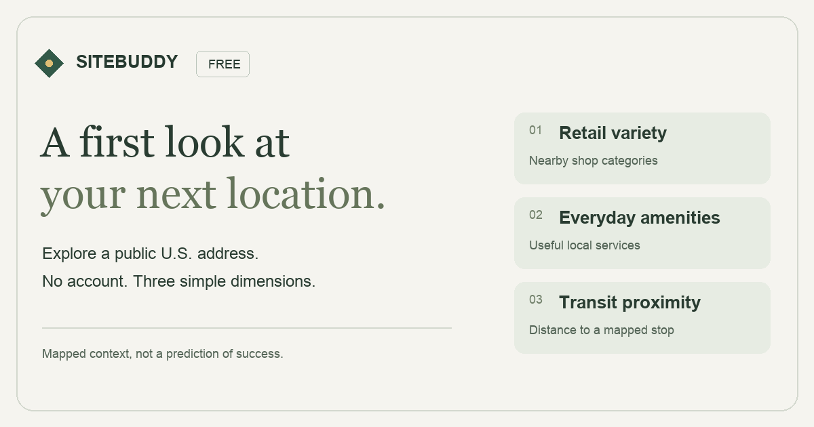

# SiteBuddy Free

**A first look at your next location.** Explore a public U.S. address through nearby retail variety, everyday amenities and transit. A transparent score out of 10, with explicit unknowns and no account required.

**v0.3.0-beta.1 candidate — bounded address coverage, safety gates in progress.** [Try SiteBuddy](https://sitebuddy-free.netlify.app/) | [Staging preview](https://sitebuddy-staging.netlify.app) | [Frozen v0.1.0 release](https://github.com/DazCherry/site-selection-engine-lite/releases/tag/v0.1.0) | [Project state](docs/PROJECT_STATE.md)



Enter an address, confirm the match, and explore mapped context within 600 meters. Share an address-free summary or try another location. Optional feedback and Early Access interest help identify the next useful question; the listed professional capabilities are not available.

| Available Free | Deliberately not measured |
| --- | --- |
| Retail variety, everyday amenities, transit proximity | Demand, demographics, competition or real footfall |
| Equal-weight three-dimension score; unknowns stay unknown | Revenue, financial feasibility, brand fit or lease suitability |
| Source provenance, local replay, address-free summaries | Paid reports, subscriptions or a Private Engine |

The original v0.1.0 rubric remains byte-for-byte frozen. It is illustrative and uncalibrated, favors mapped mixed-use transit-served settings, and is not a prediction of commercial success. More complete mapping can change a score without a real-world change. A required missing dimension withholds the total.

[Privacy and data choices](https://sitebuddy-free.netlify.app/privacy) | [How measurement works](docs/ANALYTICS.md) | [Owner launch kit](docs/launch/LAUNCH_KIT.md) | [Distribution strategy](docs/research/DISTRIBUTION_STRATEGY.md)

## Run locally

Requires Node.js 22 or newer and a modern browser. No API key is needed for synthetic examples or automated tests. Live address lookup requires the configured Netlify server function and a server-only Geocodio key. A small, checked-in browser decoder bundle uses pinned open-source dependencies with their licenses included.

```sh
git clone https://github.com/DazCherry/site-selection-engine-lite.git
cd site-selection-engine-lite
node --test tests/*.test.mjs
node scripts/publication-check.mjs
node scripts/serve.mjs
```

Open `http://127.0.0.1:4173`. Alternatively use `npm test`, `npm run check:publication`, and `npm start`. The local server binds only to loopback. Choose another local port with the `PORT` environment variable if needed. Tests open one temporary loopback port and require permission to do so.

## Try it

- **Mixed-use neighborhood:** entirely fictional records, reproducible score **7.5 / 10**.
- **Sparse mapped context:** one observed dimension, two unavailable, overall score withheld.
- **Public address:** enter street number, street, city, and country separated by commas. Explicitly consent to the disclosed address/context services, then confirm the returned address and coordinates. No address is sent before submission and consent. No city-centroid fallback.

Live requests use the same-origin Netlify function and Geocodio for address candidates and Overture’s openly licensed Places and Base releases for map context. The browser reads only nearby tiles from public object storage, avoiding an on-demand map-query server. Releases are monthly; the app checks the latest catalog and refuses release dates older than 45 days. Individual features can be much older or incorrect. Bounded retries address transient transport failures, while throttling, unavailable data and malformed data remain explicit errors. A provider failure never substitutes synthetic results. Examples continue working without providers once the app assets are loaded.

## Reproduce a result

Download the assessment snapshot from the interface, then run:

```sh
node scripts/replay.mjs /path/to/site-assessment.json
```

The snapshot contains normalized map observations, coordinates, source/retrieval timestamps, source license, model version, and result. Replay is historical: it does not claim the inputs are still current. It fails for unsupported versions, invalid records, or a stored result that differs from the recomputation. Do not commit downloaded snapshots or confidential inputs.

## Deploy with Netlify

The distribution product uses GitHub-connected Netlify hosting. The build runs tests and publication checks, copies static files to `build/`, generates canonical/social metadata, and bundles the optional server functions. Pinned dependencies install with frozen lockfile and lifecycle scripts disabled. The final approved production branch is configured after staging acceptance. See [project state](docs/PROJECT_STATE.md) for actual environments and [readiness report](DISTRIBUTION_READINESS_REPORT.md) for production status.

A production context additionally requires `SITEBUDDY_PUBLIC_RELEASE=1` and the actual Netlify `URL` (or validated `SITEBUDDY_PUBLIC_ORIGIN`). All other builds send noindex headers. Do not set the public-release flag merely because a build succeeds. Only `build/` and the explicit server functions deploy; never serve the repository root.

The local static server intentionally has no collector or submission backend. Optional features report unavailable while synthetic examples remain usable. Netlify staging is required for private-destination acceptance. No browser credentials are needed. The official Blobs SDK gets server-side context from Netlify; no token should be copied into client code.

Reproduce the decoder with `corepack pnpm install --frozen-lockfile --ignore-scripts`, then `node scripts/build-vendor.mjs`; `git diff --exit-code -- dist/vendor/tiles.mjs` must be clean. CI repeats this on Node 22. Netlify builds and tests the same source. No Paid feature, billing or private engine is deployed.

## Engineering record

[Product](docs/PRODUCT_SPEC.md) · [Architecture](docs/ARCHITECTURE.md) · [Model card](docs/MODEL_CARD.md) · [Data dictionary](docs/DATA_DICTIONARY.md) · [Data policy](docs/DATA_POLICY.md) · [IP boundary](docs/PUBLIC_PRIVATE_BOUNDARY.md) · [Security](docs/SECURITY.md) · [Tests](docs/TEST_STRATEGY.md) · [Development log](docs/DEVELOPMENT_LOG.md) · [Benchmark research](docs/research/LOCATION_INTELLIGENCE_BENCHMARK.md)

Code is published for inspection; no general software reuse license has been granted. Synthetic fixture data in `dist/samples.mjs` is dedicated to the public domain under CC0. Third-party software keeps its own licenses. Public data keeps its applicable CDLA-Permissive-2.0, Apache-2.0, CC0 and ODbL licenses; see [credits](dist/credits.html). Exported live snapshots carry license texts and attribution. Data is not relicensed as application code. This repository contains no downloaded OSM dataset, confidential reference document, or private engine implementation.

## Launch assets

[Desktop screenshot](docs/launch/sitebuddy-desktop.png) · [Mobile-width screenshot](docs/launch/sitebuddy-mobile.png) · [Launch kit](docs/launch/LAUNCH_KIT.md). Screenshots use fictional data; they were captured on the validated candidate before the final version-label update. The committed static social card is deployed directly; re-rendering its optional Python source requires Pillow and the listed macOS fonts.

## Beta address coverage

Uncertain or missing matches withhold the score. Two upstream datasets have temporary source-wide quality holds after independently confirmed wrong-building results. This also rejects some correct addresses. Confidence does not independently prove building correctness; confirm the candidate before proceeding. The 30-address benchmark offered 21 correct properties and withheld 9; a separate 10-address holdout offered 7 correct properties and withheld 3 after fixing a finding it exposed. These small purposive samples do not establish nationwide accuracy. [Decision and limitations](docs/ADR/0008-beta-address-safety.md) · [Executed acceptance](docs/BETA_ACCEPTANCE.md).
